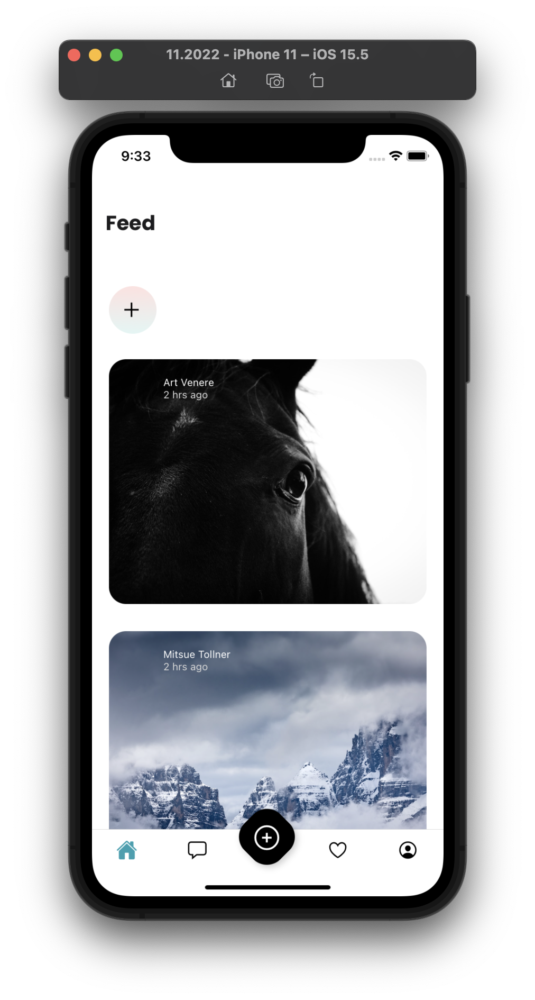

# Funbook App

This is an example app built for the Simplifying State Management in React Native book.

### Running the App

Run `yarn install` followed by `yarn start`. Choose how you would like to preview your app by running it in the simulator or on your device.

If you haven't yet done so, you may need to run `yarn install` in the root folder of this repo.

### Attributions

This app uses a free design kit: https://www.pixeltrue.com/free-ui-kits/social-media-app :heart: :fire:

Unsplash images used for this example app:
https://unsplash.com/photos/29mFwu6BENc
https://unsplash.com/photos/LHOQqONumTE
https://unsplash.com/photos/68mX-vp4H6c
https://unsplash.com/photos/4X0bFW4S_QE
https://unsplash.com/photos/Mcyv3KlRPEY
https://unsplash.com/photos/8i7F4BadwNo
https://unsplash.com/photos/rZMiCdPAlss
https://unsplash.com/photos/Y-8-JmHeWVg

Thank you! :heart:

### What to expect

If you run the app from this folder it should look like this:

